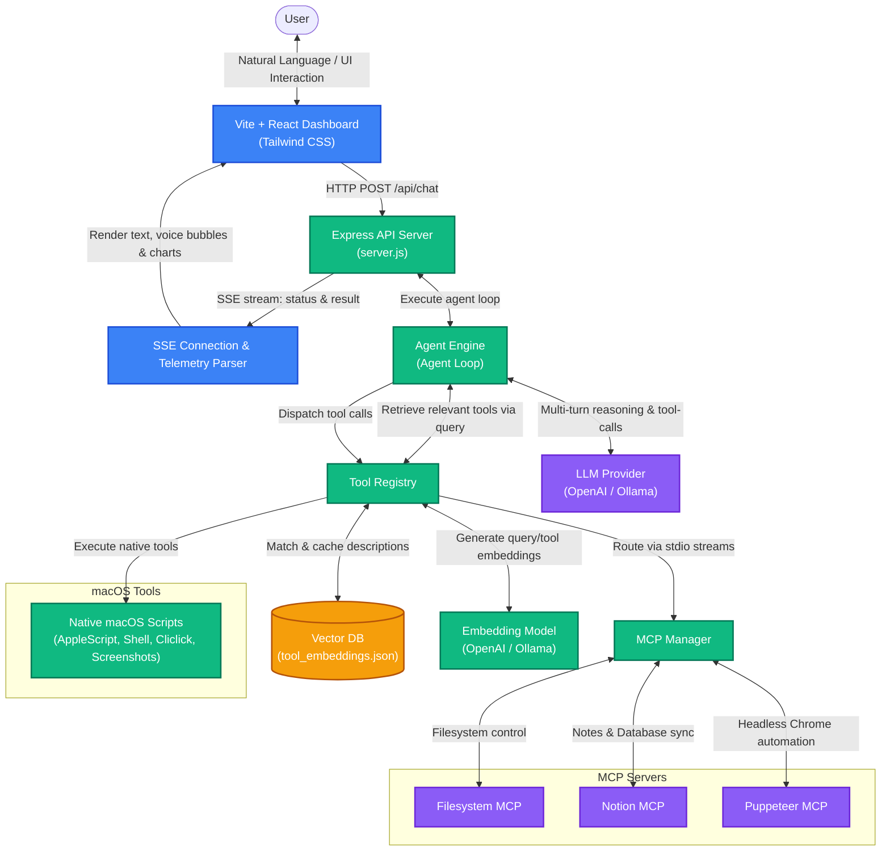

# Personal Assistant Platform

An agentic, multi-turn personal assistant platform built with Node.js, Express, React (Vite), and Model Context Protocol (MCP). It automates macOS workspace controls, runs UI/web automation flows, manages Notion workspaces, and queries local assets using a natural language interface.

---

## 🏗️ System Architecture

The following diagram illustrates how the React dashboard, Express backend server, agentic loop, vector database (RAG), and local/MCP tools interact to execute commands and stream responses:



---

## 🚀 Key Capabilities

### 1. macOS Desktop & System Control
* **Active Window Tracking**: Gets the name and title of the frontmost focused application.
* **Keyboard Automation**: Simulates custom key combinations (like `Cmd+Space`, `Enter`, `Escape`) or types multi-line text (pasted safely via clipboard backup/restore to protect special characters).
* **Mouse Control**: Performs absolute cursor movements and coordinates mouse clicking events.
* **System Utilities**: Adjusts speaker volume, checks display stats, locks the screen, empties Finder trash, and toggles Dark/Light appearance modes.
* **Application Control**: Indexes all installed GUI applications, launches them, and gracefully terminates them.
* **Music Playback**: Controls track playback (play, pause, skip, previous) in Spotify and Apple Music.
* **Network & Diagnostics**: Returns real-time disk and battery health metrics.
* **Text-To-Speech (TTS)**: Synthesizes speech feedback natively using the macOS `say` command.

### 2. Screen & UI Automation
* **Screenshots**: Captures full-screen screenshots of macOS screens (`take_screenshot`).
* **Visual Workflows**: Combines mouse/keyboard emulation to interact with desktop applications.

### 3. Model Context Protocol (MCP) Integration
* **Filesystem MCP**: Grants secure read, write, search, and directory tree navigation inside the workspace.
* **Notion MCP**: Integrates search, creation, reading, and updating pages or databases in your Notion workspace.
* **Puppeteer MCP**: Enables browser automation to scrap pages, auto-fill forms, and click selectors.

### 4. Dynamic RAG Tool Embedding System
* Uses a local vector database to index descriptions of all registered tools (local macOS tools + external MCP tools).
* Dynamically ranks the most relevant tools for your query on each prompt to keep the LLM context window small, reduce prompt latency, and maximize inference performance.

### 5. Live Streaming Telemetry Dashboard
* Connects to the backend server via **Server-Sent Events (SSE)** to display real-time LLM token streams, reasoning steps, tool calls, and tool execution status.
* Displays dedicated UI speech-to-text bubbles side-by-side with rich markdown action responses.
* Integrates a dedicated **Admin Metrics Dashboard** showing tool latencies, LLM call performance, token details, context size processing, and system execution counters.

---
---

## 🛠️ Getting Started

### 1. Setup Environment Configuration
Create a `.env` file inside `backend/` by copying `backend/.env.example` and filling in the environment variables:
```env
PORT=5001
NODE_ENV=development
LOG_LEVEL=info

# LLM Provider: 'ollama' or 'openai'
LLM_PROVIDER=openai

# OpenAI Settings (e.g. for compatible endpoints like GLM 4 or OpenAI GPTs)
OPENAI_API_KEY=your-api-key-here
OPENAI_BASE_URL=https://api.openai.com/v1/ # Optional custom base URL
OPENAI_MODEL=gpt-4o                        # Active model name/ID
```

### 2. Configure MCP Servers
Add external servers inside `backend/mcp-config.json`:
```json
{
  "mcpServers": {
    "filesystem": {
      "command": "npx",
      "args": [
        "-y",
        "@modelcontextprotocol/server-filesystem",
        "/Users/krishnakanth/Projects/PersonalAssisstent"
      ]
    },
    "notion": {
      "command": "npx",
      "args": [
        "-y",
        "@notionhq/notion-mcp-server"
      ]
    },
    "puppeteer": {
      "command": "npx",
      "args": [
        "-y",
        "@modelcontextprotocol/server-puppeteer"
      ]
    }
  }
}
```

### 3. Start the Platform
You can run the backend API server and frontend React dashboard concurrently from the root directory:
```bash
# Start both services
bash start.sh
```

Alternatively, run them separately in different terminal tabs:
* **Backend**: 
  ```bash
  cd backend
  npm run dev
  ```
* **Frontend**: 
  ```bash
  cd frontend
  npm run dev
  ```

---

## 📂 Project Structure
* [frontend/](file:///Users/krishnakanth/Projects/PersonalAssisstent/frontend): React (Vite) telemetry dashboard and chat client interface.
* [backend/](file:///Users/krishnakanth/Projects/PersonalAssisstent/backend): Node.js Express server orchestrating LLM tool selection (RAG) and macOS automation.
