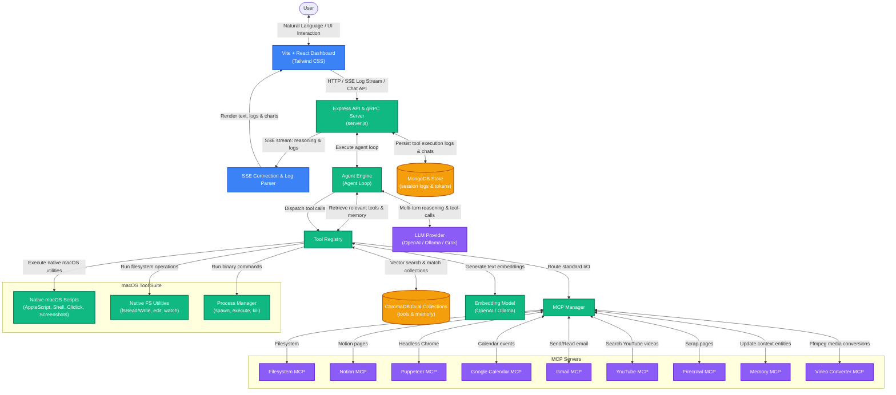

# Personal Assistant Platform

An agentic, multi-turn personal assistant platform built with Node.js, Express, React (Vite), MongoDB, ChromaDB, and the Model Context Protocol (MCP). It automates macOS workspace controls, runs UI/web automation flows, manages Notion databases, accesses Google services (Calendar, Gmail), converts media, registers long-term memory facts, and retrieves files/tools dynamically using a natural language interface.

---

## 🏗️ System Architecture

The following diagram illustrates how the frontend React dashboard, Express orchestrator, agentic loop, vector databases (ChromaDB), document database (MongoDB), and the various native and MCP tool interfaces interact:



---

## 🚀 Key Capabilities

### 1. Unified macOS Tool Suite
* **Process Management**: Safely executes, monitors, lists, and kills allow-listed system processes (e.g. `git`, `rg`, `npm`, `shortcuts`, `osascript`).
* **Advanced File System Controls**: Creates, copies, moves, deletes, reads, and edits files. Automatically watches for file changes, reads/sets extended file attributes (`xattr`), and exports text content as formatted PDFs.
* **Window & Workspace control**: Indexes open app windows, focuses specific applications, shifts windows to precise coordinates, resizes views, and manages macOS virtual spaces.
* **Desktop & Input Emulation**: Mimics complex cursor movements, clicks, dragging, scrolling, and safe keystroke inputting via clipboard staging.
* **Apple Integrations**: Launches and monitors Apple Reminders (`reminder_list`, `reminder_add`) and handles macOS iPhone Mirroring launcher sessions.
* **System Utilities & Playback**: Adjusts audio volume levels, locks screens, checks hardware/battery stats, triggers Dark/Light appearance modes, empties Finder trash, controls music (Spotify/Apple Music), and speaks text natively using the macOS `say` command.

### 2. Dual-Collection ChromaDB RAG Pipeline
* **Tools Collection (`tools_db` / `tools_nomic_embed`)**: Stores definitions and embeddings for all registered local and MCP tools. Dynamically selects and injects the top relative tools into the LLM context window to optimize latency and reliability.
* **Long-Term Memory Collection (`personal_db` / `personal_info_nomic_embed`)**: Stores user-scoped observations, entities, and observations parsed from `memory.json` to maintain persistent user context across different threads.
* **Embedding Providers**: Plugs dynamically into standard OpenAI endpoints (`text-embedding-3-small`) or local Ollama configurations (`nomic-embed-text`).

### 3. Model Context Protocol (MCP) Integration
* Spawns and manages standard input/output (`stdio`) client sessions to **9 different MCP servers**:
  - `filesystem` (Directory trees, read/write/find)
  - `notion` (Integrates notes, tasks, page creation)
  - `puppeteer` (Headless browser automation)
  - `google-calendar` (Checks and creates calendar events)
  - `gmail` (Drafts and reads email messages)
  - `youtube` (Queries transcriptions and metadata)
  - `firecrawl` (Web scraper markdown converter)
  - `memory` (Semantic graph registry)
  - `video-converter` (Ffmpeg-based video and audio transcoder)

### 4. Interactive Telemetry & Administrative Dashboard
* **Server-Sent Events (SSE)**: Streams real-time LLM token replies, reasoning steps, tool calls, and execution logs.
* **System Prompt Console**: Creates, reviews, deletes, and activates app-wide system prompt contexts dynamically.
* **Settings Control Panel**: Dynamically updates LLM providers, model sizes, custom base URLs, and Google OAuth login/disconnect states.
* **Admin Logs & Test Center**: Streams raw system logs in real-time. Includes tools for manual single-function triggers and a RAG performance evaluation test suite.

### 5. High-Performance Hybrid Chat History
* **Sliding Window Context**: Injects the last 6 active session messages directly into the LLM context to ensure perfect short-term recall.
* **In-Memory Keyword Search**: Groups older session logs into QA turns and dynamically retrieves relevant turns via fast token search, enabling long-term session recall with 0ms embedding latency.

---

## 🛠️ Getting Started

### 1. Start Database Infrastructure
Make sure you have MongoDB and ChromaDB running locally:
```bash
# Start MongoDB locally (usually default port 27017)
mongod --dbpath /usr/local/var/mongodb

# Start ChromaDB locally (default port 8000)
chroma run --path ./data/chroma_db
```

### 2. Setup Environment Configuration
Copy the configuration template inside `backend/` to create a `.env` file:
```bash
cp backend/.env.example backend/.env
```
Open `backend/.env` and supply your API keys (e.g. `OPENAI_API_KEY`, `GITHUB_PERSONAL_ACCESS_TOKEN`, `YOUTUBE_API_KEY`, `FIRECRAWL_API_KEY`).

### 3. Configure Google OAuth Credentials (Optional)
For Google Calendar and Gmail MCP servers, place your downloaded Google API credentials JSON at:
`backend/gcp-oauth.keys.json`

### 4. Install Dependencies & Run the App
Install npm libraries in both folders and launch the services:

* **Backend**:
  ```bash
  cd backend
  npm install
  npm run dev
  ```
* **Frontend**:
  ```bash
  cd frontend
  npm install
  npm run dev
  ```

Open your browser and navigate to `http://localhost:5173`.

---

## 📂 Project Structure

* [/frontend](file:///Users/krishnakanth/Projects/PersonalAssisstent/frontend): React (Vite) telemetry dashboard, chat client, settings panel, and system prompt manager.
* [/backend](file:///Users/krishnakanth/Projects/PersonalAssisstent/backend): Node.js Express server acting as the agentic orchestrator, RAG query vector engine, and system automation dispatcher.
* [/mcps](file:///Users/krishnakanth/Projects/PersonalAssisstent/mcps): Custom Python/Node MCP servers (YouTube, Video Converter).

