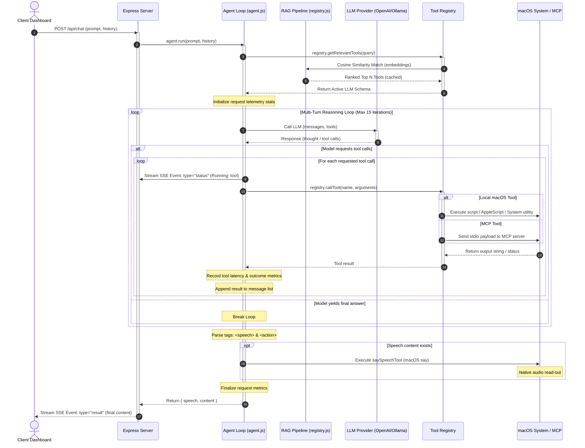

# Personal Assistant Backend Engine

The backend is a Node.js Express server acting as the orchestrator for the Personal Assistant. It coordinates LLM reasoning, registers local macOS and external Model Context Protocol (MCP) tools, ranks tools dynamically using an embedded vector database (RAG), collects system and runtime telemetry metrics, and streams reasoning logs and completions via Server-Sent Events (SSE).

---

## 🔁 Agent Orchestration & Reasoning Loop

The core execution path coordinates local vector database lookups, multi-turn LLM reasoning, tool execution, telemetry tracking, and native text-to-speech output:



---

## 📂 Backend Architecture & Components

The codebase is organized into modular services:
1. **HTTP Server** ([src/server.js](file:///Users/krishnakanth/Projects/PersonalAssisstent/backend/src/server.js)): Exposes API routes, sets up CORS, registers Server-Sent Events headers for chat, and starts the service.
2. **MCP Manager** ([src/mcp/mcpManager.js](file:///Users/krishnakanth/Projects/PersonalAssisstent/backend/src/mcp/mcpManager.js)): Spawns and manages standard input/output (`stdio`) streams to external Model Context Protocol servers.
3. **Tool Registry** ([src/orchestrator/registry.js](file:///Users/krishnakanth/Projects/PersonalAssisstent/backend/src/orchestrator/registry.js)): Maintains the catalog of native macOS tools and registers dynamically loaded MCP tools under a unified call dispatcher.
4. **Agent Loop** ([src/orchestrator/agent.js](file:///Users/krishnakanth/Projects/PersonalAssisstent/backend/src/orchestrator/agent.js)): Drives the multi-turn agent conversation, injects system prompt constraints, handles fallback XML/JSON parsing, executes speech feedback, and tracks token evaluation speeds.
5. **RAG Pipeline** ([src/rag/](file:///Users/krishnakanth/Projects/PersonalAssisstent/backend/src/rag)): Matches prompts against tool embeddings to filter candidates. Contains:
   - `vectorDb.js`: Manages a local file-based database (`data/tool_embeddings.json`) and handles validation/expiration caches.
   - `embedder.js`: Connects to OpenAI or Ollama to generate vector embeddings.
   - `pipeline.js`: Ranks and filters active tools using cosine similarity thresholds.
6. **Telemetry Service** ([src/utils/metrics.js](file:///Users/krishnakanth/Projects/PersonalAssisstent/backend/src/utils/metrics.js)): Captures runtime statistics (request logs, tool count/success rates, average generation speeds, screenshots, and UI fetch occurrences) and stores them in `data/metrics.json`.

---

## 🛠️ Registered macOS Native Tools

Local tools are registered in [src/tools/mac/index.js](file:///Users/krishnakanth/Projects/PersonalAssisstent/backend/src/tools/mac/index.js) and executed using shell scripts, native binary invocations, or AppleScript.

### System & Workspace Control
* **`list_applications`**: Indexes and returns GUI apps installed on macOS.
* **`open_application`**: Launches target apps via standard shell execution (`open -a`).
* **`close_application`**: Quits specific apps gracefully using AppleScript.
* **`open_url`**: Opens URLs in the default browser.
* **`get_active_window`**: Retrieves the frontmost focused application's name.
* **`keystroke_action`**: Emulates keyboard key combinations or types safe text inputs (via clipboard staging to preserve layout formatting).
* **`system_power`**: Sets macOS sleep states, display timeout limits, or locks screens.
* **`lock_screen`**: Locks the display session instantly.
* **`say_speech`**: Synthesizes spoken voice audio using macOS `say`.
* **`empty_trash`**: Empties Finder trash folders.
* **`run_applescript`**: Executes raw AppleScript scripts directly for generic automation.

### Audio & Playback Control
* **`get_volume`**: Returns active master output volume levels (0-100).
* **`volume_set`**: Adjusts system output speaker volumes.
* **`media_control`**: Commands play/pause/skip events in Spotify and Apple Music.

### Network & Performance Diagnostics
* **`get_system_stats`**: Retrieves battery metrics and primary disk space limits.

### Desktop Screen Automation
* **`take_screenshot`**: Captures screen images and saves files inside `data/screenshots/`.

### Task Utilities
* **`timer`**: Emulates macOS clock operations to set alerts or count-down timers.

---

## 📡 API REST Endpoints

### 1. Health Status
* **Endpoint**: `GET /`
* **Response**:
  ```json
  {
    "status": true,
    "os": "darwin",
    "message": "Server is running"
  }
  ```

### 2. Active Config
* **Endpoint**: `GET /api/config`
* **Response**:
  ```json
  {
    "success": true,
    "provider": "openai",
    "model": "gpt-4o",
    "openaiBaseUrl": "https://api.openai.com/v1/",
    "port": 5001
  }
  ```

### 3. Active Tools Schema
* **Endpoint**: `GET /api/tools`
* **Purpose**: Fetches the JSON schema of all registered macOS and active MCP tools formatted for LLM function calling.

### 4. Telemetry Metrics
* **Endpoint**: `GET /api/metrics`
* **Response**: Returns full telemetry data structure including aggregates (success rates, average latencies) and detailed request execution arrays.
* **Clear Metrics**: `DELETE /api/metrics`
  Clears telemetry database records.

### 5. Chat Completion (SSE Stream)
* **Endpoint**: `POST /api/chat`
* **Headers**: `Content-Type: text/event-stream`
* **Payload**:
  ```json
  {
    "prompt": "Increase master volume to 50 percent",
    "history": []
  }
  ```
* **Event Data Chunks**:
  - `type: "status"`: Reasoning steps (e.g. `{"type":"status","content":"Running: volume_set"}`)
  - `type: "result"`: Final assistant response object (e.g. `{"type":"result","content":{"speech":"I've set the volume to 50 percent.","content":"### Volume updated to 50% successfully."}}`)
  - `type: "error"`: Failure details.
