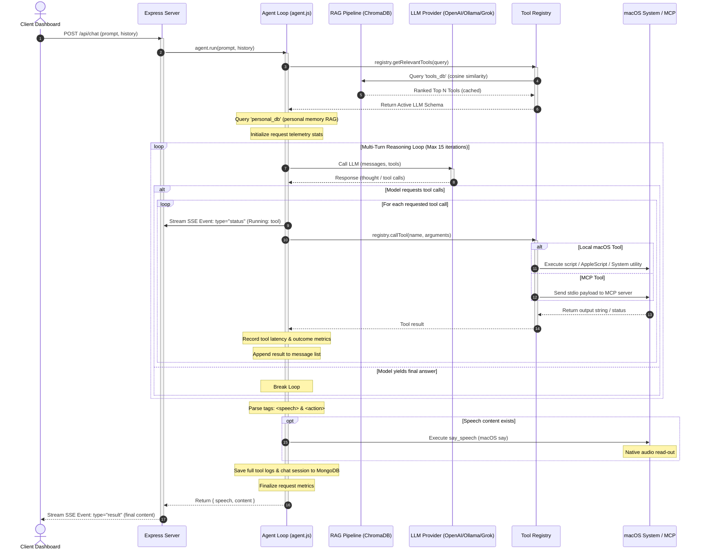

# Personal Assistant Backend Engine

The backend is a Node.js Express server acting as the orchestrator for the Personal Assistant. It coordinates LLM reasoning, registers local macOS and external Model Context Protocol (MCP) tools, ranks tools and personal context dynamically using ChromaDB (RAG), collects system and runtime telemetry metrics, persists chat sessions in MongoDB, and streams reasoning logs and completions via Server-Sent Events (SSE).

---

## 🔁 Agent Orchestration & Reasoning Loop

The core execution path coordinates local vector database lookups, multi-turn LLM reasoning, tool execution, telemetry tracking, and native text-to-speech output:

---

## 📂 Backend Architecture & Components

The codebase is organized into modular services:
1. **HTTP Server** ([src/server.js](file:///Users/krishnakanth/Projects/PersonalAssisstent/backend/src/server.js)): Exposes API routes, sets up CORS, handles OAuth callbacks, serves downloads and screenshots, and boots services.
2. **MCP Manager** ([src/mcp/mcpManager.js](file:///Users/krishnakanth/Projects/PersonalAssisstent/backend/src/mcp/mcpManager.js)): Configures, boots, and communicates with 9 different external `stdio` Model Context Protocol servers.
3. **Tool Registry** ([src/orchestrator/registry.js](file:///Users/krishnakanth/Projects/PersonalAssisstent/backend/src/orchestrator/registry.js)): Registers, pre-warms, and routes execution payloads to local macOS scripts or external MCP clients.
4. **Agent Loop** ([src/orchestrator/agent.js](file:///Users/krishnakanth/Projects/PersonalAssisstent/backend/src/orchestrator/agent.js)): Drives the multi-turn agent logic, formats prompt boundaries, queries memory collections, logs data to MongoDB, and handles SSE log emitters.
5. **RAG Pipeline** ([src/rag/](file:///Users/krishnakanth/Projects/PersonalAssisstent/backend/src/rag)): Matches queries against embeddings. Contains:
   - `vectorDb.js`: Connects to ChromaDB `tools_db` (collection `tools_nomic_embed`) and caches tool metadata.
   - `personalDb.js`: Connects to ChromaDB `personal_db` (collection `personal_info_nomic_embed`) and syncs memories from `memory.json`.
   - `embedder.js`: Connects to OpenAI (`text-embedding-3-small`) or Ollama (`/api/embed`) to fetch vectors.
   - `pipeline.js`: Compares cosine similarities to rank relevant tools.
6. **Telemetry & Logs** ([src/utils/metrics.js](file:///Users/krishnakanth/Projects/PersonalAssisstent/backend/src/utils/metrics.js)): Records execution speed, screenshots, errors, and system count records.
7. **Database Drivers** ([src/config/](file:///Users/krishnakanth/Projects/PersonalAssisstent/backend/src/config)): Contains `mongodb.js` (Express-wide MongoDB client connectivity) and `env.js` (environment parser).

---

## 🛠️ Registered macOS Native Tools

Local tools are registered in [src/tools/mac/index.js](file:///Users/krishnakanth/Projects/PersonalAssisstent/backend/src/tools/mac/index.js) and run natively via child shell processes, CLI programs, or AppleScript.

### 1. Process Management (`processTools.js`)
* **`process_run`**: Runs an allow-listed process synchronously with a custom timeout limit.
* **`process_start`**: Starts an allow-listed process asynchronously, returning a session ID.
* **`process_read_output`**: Non-blocking read of stdout/stderr buffers from an active async process session.
* **`process_write_input`**: Writes text input to an active async process session stdin.
* **`process_terminate`**: Sends a SIGTERM (then SIGKILL) to an async process session.
* **`process_list`**: Lists active running processes on the system (PID, command).
* **`process_kill`**: Sends terminate signals directly to system process PIDs (excludes PID 1).

### 2. Advanced File System Utilities (`fsTools.js`)
* **`fs_read`**: Reads files from disk.
* **`fs_read_many`**: Reads multiple files in a single batch request.
* **`fs_write`**: Overwrites or creates files on disk.
* **`fs_edit`**: Performs precision find-and-replace text modifications on files.
* **`fs_write_pdf`**: Translates text contents into a formatted PDF file.
* **`fs_list`**: Lists directory structures with metadata flags.
* **`fs_stat`**: Returns stat descriptors (size, updates) for target paths.
* **`fs_copy`**: Copies files or directories.
* **`fs_move`**: Renames or relocates filesystem elements.
* **`fs_make_dir`**: Generates recursive directories.
* **`fs_delete`**: Removes files or folders recursively.
* **`fs_watch_once`**: Sets up temporary listeners for file modifications.
* **`fs_xattr_get`**: Reads macOS extended attributes (`xattr`) on files.
* **`fs_xattr_set`**: Writes custom extended attributes metadata onto files.

### 3. Window & Space Management (`appWindowTools.js`)
* **`list_apps`**: Lists open/running graphical applications on macOS.
* **`list_windows`**: Lists open application window instances, including IDs and sizes.
* **`focus_app`**: Raises all window instances of a target application.
* **`focus_window`**: Brings a specific window ID to front focus.
* **`move_window`**: Shifts a window's upper-left corner coordinates.
* **`resize_window`**: Adjusts width and height configurations of a target window.
* **`set_space`**: Changes macOS virtual desktop spaces.

### 4. Input & Automation Controls (`inputTools.js`, `keystroke.js`)
* **`mouse_move`**: Moves the mouse cursor to absolute pixel coordinates.
* **`mouse_click`**: Clicks left/right/double at target screen positions.
* **`mouse_drag`**: Simulates cursor drag operations between coordinates.
* **`mouse_scroll`**: Performs vertical or horizontal mouse wheel scroll events.
* **`key_press`**: Emulates mechanical keyboard key taps.
* **`type_text`**: Emulates safe layout text typing via clipboard backups.
* **`keystroke_action`**: Runs customizable chord key combinations (e.g. `Cmd+Space`).

### 5. Application Integrations (`reminders.js`, `iphoneMirrorTools.js`)
* **`reminder_list`**: Retrieves custom lists from the native Apple Reminders app.
* **`reminder_add`**: Appends new task items and due-dates to Apple Reminders.
* **`reminder_complete`**: Marks Reminders items as completed.
* **`mirror_start`**: Controls and launches native macOS iPhone Mirroring apps.

### 6. Workspace Utilities & Diagnostics
* **`list_applications`** (`listApplications.js`): Indexes and details all installed applications.
* **`open_application`** (`openApplication.js`): Spawns target applications (`open -a`).
* **`close_application`** (`closeApplication.js`): Gracefully terminates apps using AppleScript.
* **`open_url`** (`openUrl.js`): Launches links in default web browsers.
* **`get_active_window`** (`activeWindow.js`): Retrieves name of the frontmost focused app window.
* **`system_power`** (`systemPower.js`): Adjusts macOS sleep timers, display lock screens, or powers down.
* **`lock_screen`** (`lockScreen.js`): Instantly locks the display.
* **`say_speech`** (`saySpeech.js`): Speaks text audio natively using macOS `say`.
* **`empty_trash`** (`emptyTrash.js`): Clears Finder trash directories.
* **`run_applescript`** (`runAppleScriptTool.js`): Compiles and runs raw AppleScript text strings.
* **`get_volume`** (`getVolume.js`): Inspects master audio output levels (0-100).
* **`volume_set`** (`volumeSet.js`): Changes system master speaker volumes.
* **`media_control`** (`mediaControl.js`): Controls playback commands on Spotify and Apple Music.
* **`get_system_stats`** (`getSystemStats.js`): Inspects macOS battery health and disk limits.
* **`take_screenshot`** (`screenshot.js`): Captures full-screen images to `data/screenshots/`.
* **`timer`** (`timer.js`): Starts countdown timers and creates alerts.

---

## 📡 API REST Endpoints

### 1. General & Configuration
* **`GET /`**: Returns system health, platform info (`darwin`), and server status.
* **`GET /api/config`**: Fetches current LLM provider, models, bases, and port mappings.
* **`POST /api/config`**: Updates server configuration variables dynamically.
* **`GET /api/models`**: Lists available models from Ollama or OpenAI compatible profiles.

### 2. Tools & RAG Testing
* **`GET /api/tools`**: Fetches the structured schemas of all active macOS and MCP tools.
* **`GET /api/tools/search`**: Vector searches the RAG registry using a semantic text query.
* **`POST /api/tools/test`**: Directly fires a tool's execute function by name with arguments.
* **`POST /api/tools/run-tests`**: Triggers the background RAG suite evaluation test.
* **`POST /api/tools/stop-tests`**: Stops the running RAG suite evaluation test.

### 3. Google OAuth Flows
* **`GET /api/auth/google/url`**: Generates a Google consent URL.
* **`GET /api/auth/google/callback`**: OAuth callback endpoint that syncs calendar tokens.
* **`GET /api/auth/google/status`**: Returns connection status and active email indicators.
* **`POST /api/auth/google/disconnect`**: Clears saved Google tokens from MongoDB and memory.

### 4. MCP Servers Telemetry
* **`GET /api/mcp/status`**: Lists all active MCP clients and their background progress updates.
* **`POST /api/mcp/progress`**: Endpoint for long-running MCP scripts to update progress details.

### 5. Chat Completion & Sessions
* **`POST /api/chat`**: Standard chat handler. Streams LLM completions and reasoning logs via SSE.
* **`POST /api/chat/stop`**: Cancels active streaming generation threads immediately.
* **`GET /api/chats`**: Lists all saved chat sessions stored in MongoDB.
* **`GET /api/chats/:sessionId`**: Retrieves full message logs for a target session.
* **`DELETE /api/chats/:sessionId`**: Deletes a saved chat session from MongoDB.

### 6. Logging & Performance Metrics
* **`GET /api/metrics`**: Returns aggregated latencies, success rates, and tool records.
* **`DELETE /api/metrics`**: Resets and clears the telemetry store.
* **`GET /api/logs/stream`**: Server-Sent Events stream that emits raw console/file logs to the client UI.

### 7. System Prompts Manager
* **`GET /api/system-prompt`**: Retrieves system prompts (default and custom templates).
* **`POST /api/system-prompt`**: Creates or updates a system prompt record.
* **`POST /api/system-prompt/activate`**: Activates a specific system prompt configuration.
* **`DELETE /api/system-prompt/:id`**: Removes a custom system prompt.
