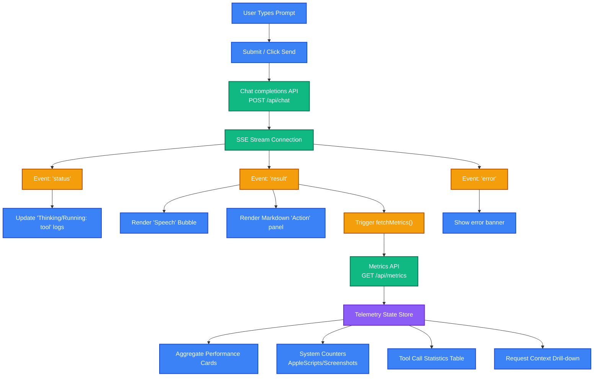

# Personal Assistant Frontend Dashboard

The frontend is a modern React application built on Vite and styled with Tailwind CSS. It acts as the interactive interface for the Personal Assistant platform, providing real-time streaming chat completions, active config settings, OAuth integrations, a system prompt editor, and an administrative telemetry suite.

---

## 📊 Dashboard Data & Telemetry Flow

The frontend coordinates user input, Server-Sent Events (SSE) stream parsing, and telemetry monitoring:



---

## 🎨 UI Sections & Modules

The client interface is modularly structured into dedicated layout panels managed via the root sidebar navigation:

### 1. Chat Panel (`ChatPanel.jsx`)
* **Interactive Chat Console**: Supports multi-turn reasoning conversations.
* **Dual Rendering Speech & Actions**:
  - **Speech Bubbles**: Displays voice-friendly spoken text with native web audio playback capabilities.
  - **Action Panels**: Renders markdown containing system command results, code listings, system statistics, and text-to-speech toggles.
* **Reasoning Logs**: Emits real-time agent execution status indicators (e.g. `Running: process_run`).

### 2. Settings Panel (`SettingsPanel.jsx`)
* **Orchestrator Configs**: Adjusts active LLM providers (OpenAI, Ollama, Grok), models, and base API endpoints.
* **Google OAuth Flow**: Toggles authorization links for Google Calendar and Gmail MCP servers, displaying connectivity status and disconnected handlers.

### 3. System Prompt Panel (`SystemPromptPanel.jsx`)
* **System Prompt Editor**: CRUD editor to write, view, rename, activate, or delete custom system prompts to instruct the orchestrator's behavior.

### 4. Admin Dashboard (`AdminDashboard.jsx`)
* **Live System Logs**: Connects to the backend log SSE stream, displaying real-time server runtime/debug output console in the UI.
* **RAG Test Center**: Runs manual triggers for single tool execution test runs, starts/stops automated RAG suites, and reports evaluation scores.
* **Performance Cards**: Aggregates average RAG retrieval latency, generation speeds, success metrics, and request details.
* **Telemetry History**: Sidebar displaying all executed tasks, allowing developers to inspect system tokens, parameters, prompt contents, and execution metrics.
* **Tool Aggregation Statistics**: Renders usage counts, failure details, and average processing latency in a clean table view.

### 5. Main Sidebar Navigation (`Sidebar.jsx`)
* Toggles workspace views between the Chat Console, Settings Console, System Prompt Manager, and the Admin Dashboard.

---

## 🛠️ Local Development & Scripts

The frontend is bootstrapped using Vite. Dependencies are tracked inside [package.json](file:///Users/krishnakanth/Projects/PersonalAssisstent/frontend/package.json).

### Run Development Server
```bash
npm run dev
```
By default, the Vite dev server runs on `http://localhost:5173`. It connects to the backend API at `http://localhost:3000` (or the port defined in backend environment configurations).

### Build for Production
To generate the static bundle optimized with Oxlint rules:
```bash
npm run build
```
Outputs static assets into `dist/`.
