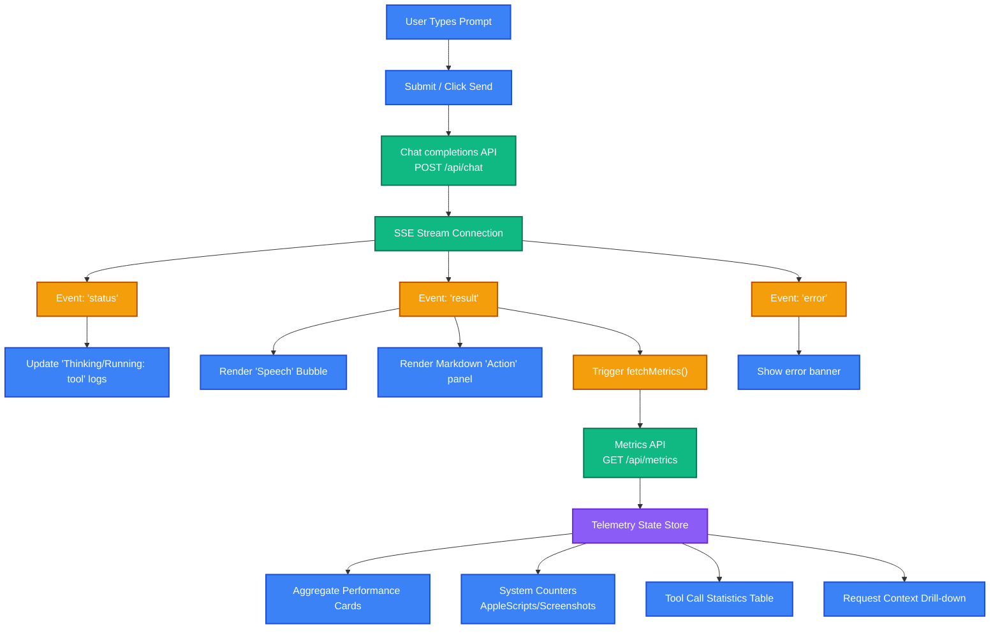

# Personal Assistant Frontend Dashboard

The frontend is a modern React application built on Vite and styled with Tailwind CSS. It acts as the interactive interface for the Personal Assistant platform, providing real-time streaming chat completions, system config panels, speech-to-text feedback bubbles, and an administrative telemetry dashboard.

---

## 📊 Dashboard Data & Telemetry Flow

The frontend coordinates user input, Server-Sent Events (SSE) stream parsing, and telemetry monitoring:



---

## 🎨 UI Sections & Modules

The client interface (orchestrated inside [src/App.jsx](file:///Users/krishnakanth/Projects/PersonalAssisstent/frontend/src/App.jsx)) is divided into three key layouts:

### 1. Chat & Reasoning Console
* **User Input**: Text field supporting prompt entries and keyboard submission.
* **Dual-Content Messages**: 
  - **Speech Bubble**: Highlighted bubbles showing spoken, voice-friendly text (with a speaker icon representing text-to-speech output).
  - **Action Block**: A markdown rendered block containing code sections, system statistics, file changes, and detailed logs.
* **Reasoning Logs**: Intermediate status badges updating in real-time as the agent runs tools (e.g., `Running: active_window` ➔ `Running: take_screenshot` ➔ `Thinking...`).

### 2. Header & Configuration Sidebar
* **Health Panel**: Displays connection status (Online/Offline) and operating system platform.
* **Active Config View**: Connects to `/api/config` to display:
  - LLM Provider (OpenAI/Ollama).
  - Model Name.
  - Custom Base URL and API Endpoint.
  - Active express port.

### 3. Admin Telemetry & Metrics Dashboard
Toggled from the header bar, this module fetches, aggregates, and visualizes performance data from the backend's `metrics.json` file:
* **Sidebar Logs**: A vertical list of all executed requests, displaying prompt summaries, timestamps, durations, and success/failure badges.
* **Performance Aggregate Cards**:
  - **Total Requests**: Count of requests.
  - **Success Rate**: Percentage of request execution loops completed without exceptions.
  - **Average Latency**: Average request duration, split into RAG Retrieval Time, LLM Response Generation, and Context Processing Time.
* **System Operations Counters**: Tracks system action metrics:
  - Total screenshots captured.
  - Total AppleScript executions.
  - Screen annotation queries.
* **Tool Usage Panel**: A tabular view listing each tool (e.g., `keystroke_action`, `annotate_screen`, `notion_mcp`) with:
  - Execution counts.
  - Success rates.
  - Average execution latency (ms).
* **Drill-down Inspector**: Clicking any request in the history displays the exact prompt, final outcome, step-by-step tool latency timeline, and raw vector database context fields passed into the model.

---

## 🛠️ Local Development & Scripts

The frontend is bootstrapped using Vite. Dependencies are tracked inside [package.json](file:///Users/krishnakanth/Projects/PersonalAssisstent/frontend/package.json).

### Run Development Server
```bash
npm run dev
```
By default, the Vite dev server runs on `http://localhost:5173`. It connects to the backend API at `http://localhost:3000` (or the port defined in backend environment configurations).

### Build for Production
To generate the static bundle optimized with Oxlint rules:
```bash
npm run build
```
Outputs static assets into `dist/`.
